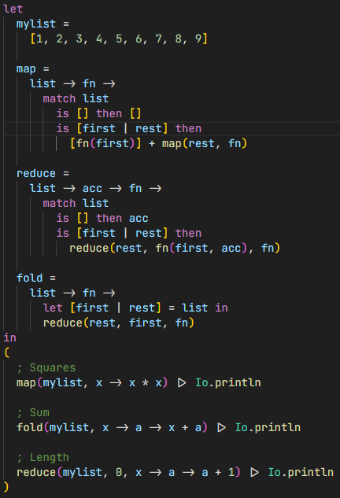

# bella-lang

This extension enables basic language features for the [Bella](https://github.com/mystpi/bella) programming language.

## Features

As of now this extension only provides syntax highlighting and smart indentation.

